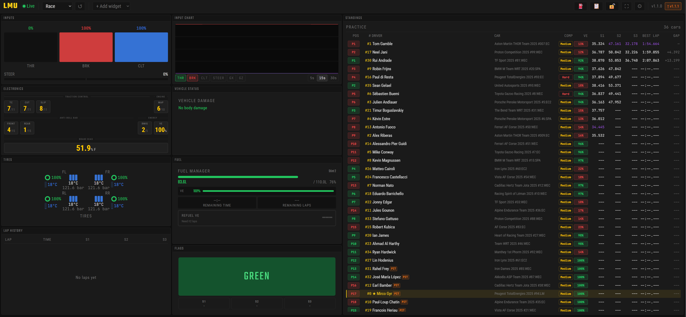

# LMU Pitwall

Real-time sim racing dashboard for [Le Mans Ultimate](https://www.lemansultimate.com/). Runs as a single `.exe` on your racing PC and serves the dashboard to any browser on the same network.



## Install

Download `LMU-Pitwall-Setup-X.X.X.exe` from the [latest release](https://github.com/Swizzjack/lmu-pitwall/releases), run the installer, start Le Mans Ultimate, then open the dashboard in any browser:

```
http://<racing-pc-ip>:9000
```

No configuration required. A portable `lmu-pitwall.exe` (no installer) is also on the releases page.

## Shared Memory Plugin (Required)

LMU Pitwall reads telemetry via the [rF2 Shared Memory Map Plugin](https://github.com/TheIronWolfModding/rF2SharedMemoryMapPlugin) by TheIronWolf. This plugin is not bundled with LMU and must be installed once.

**Step 1 — Install the DLL**

Download `rFactor2SharedMemoryMapPlugin64.dll` from the plugin's latest release and place it at:

```
Le Mans Ultimate\Plugins\rFactor2SharedMemoryMapPlugin64.dll
```

**Step 2 — Enable in `CustomPluginVariables.JSON`**

Open or create `Le Mans Ultimate\UserData\player\CustomPluginVariables.JSON` and add:

```json
{
  "rFactor2SharedMemoryMapPlugin64.dll": {
    " Enabled": 1,
    "DebugISIInternals": 0,
    "DebugOutputLevel": 0,
    "DebugOutputSource": 0,
    "DedicatedServerMapGlobally": 0,
    "EnableDirectMemoryAccess": 0,
    "EnableHWControlInput": 0,
    "EnableRulesControlInput": 0,
    "EnableWeatherControlInput": 0,
    "UnsubscribedBuffersMask": 0
  }
}
```

> The leading space in `" Enabled"` is required by the rF2 plugin engine.

**Step 3 — Activate in-game**

Settings → Gameplay → Enable Plugins → ON, then restart LMU. Plugins only take effect after a full restart.

## Usage

1. Start Le Mans Ultimate
2. Run `lmu-pitwall.exe`
3. Open a session (Practice, Qualifying, or Race)
4. Open `http://<racing-pc-ip>:9000` in any browser on your local network

The dashboard auto-connects and updates in real time. On first run, Windows Firewall may prompt you to allow port 9000.

## Features

| Widget | Description |
|--------|-------------|
| **Fuel** | Fuel remaining, median consumption per lap (rolling average, excludes first lap of each stint), laps to empty, fuel needed to finish |
| **Standings** | Live positions with car number, brand, gap to leader, sector times, pit status, and a MiniDamageGrid per car |
| **VehicleStatus** | Damage overview at three detail levels: compact, medium, or full — covers aero, brakes, and suspension |
| **Electronics** | TC, ABS, Engine Map, ARB, Regen, Brake Migration — read directly from shared memory, no button-counting; works in online sessions (EAC-protected) |
| **Tires** | Temperatures (inner/middle/outer/carcass), pressures, wear %, and brake disc temps per corner |
| **Race Engineer** | Spoken callouts during practice, qualifying, and race: tire wear warnings, weather escalations, pace deltas, fuel status, flag alerts |
| **Strategy** | Virtual Energy (VE) per lap from LMU REST API; Fuel Calculator for multi-stint planning |
| **Track Map** | SVG live track map with real-time vehicle positions |
| **Weather** | Current and forecast conditions |
| **Inputs** | Throttle, brake, and steering trace |
| **Flags** | Real-time flag display (green, blue, yellow, red, chequered) with session-phase awareness |
| **Time** | Session time, time remaining, lap counter |
| **Post Race Results** | Load any LMU session XML to view full classification, lap times, sectors, gaps, and pitstop data |
| **Toolbar** | Shows local IP and port for quick browser access from a second device |

Widget layout is drag-and-drop; positions and sizes are saved automatically.

## Architecture

```
Le Mans Ultimate (Windows)
├── rF2 Shared Memory  (~60 Hz telemetry)
└── REST API  :6397
    ├── GET /rest/strategy/usage                        (Virtual Energy history)
    └── GET /rest/garage/UIScreen/RepairAndRefuel       (wearables: aero, brakes, suspension)

lmu-pitwall.exe (Rust, single binary)
├── Shared Memory reader ──────────────────────────────► WebSocket server :9000
├── REST API client ───────────────────────────────────► WebSocket server :9000
└── HTTP server :9000
    ├── Upgrade: websocket  → WebSocket handler (live telemetry)
    ├── GET /              → index.html  (React SPA entry)
    ├── GET /assets/*      → hashed JS/CSS bundles (immutable cache)
    ├── GET /api/network-info
    ├── GET /api/version
    └── POST /api/shutdown

Browser (any device on LAN)
├── ws://<ip>:9000   live telemetry stream
└── http://<ip>:9000  React SPA (served from embedded rust-embed assets)
```

A single port handles both WebSocket upgrades and static file serving. The React bundle is embedded in the binary via `rust-embed` — no separate file deployment needed.

## Building from Source

**Environment:** Bazzite (Fedora Atomic) or any Fedora-based system. A [distrobox](https://github.com/89luca89/distrobox) container works well for keeping the toolchain isolated.

**One-time setup:**

```bash
# Rust toolchain
curl https://sh.rustup.rs -sSf | sh
rustup target add x86_64-pc-windows-gnu

# cargo-zigbuild (cross-compilation, no MinGW needed)
cargo install cargo-zigbuild
# Zig 0.13+: https://ziglang.org/download/ or via dnf/distrobox

# Node.js — use system package manager or https://nodejs.org
cd dashboard && npm install && cd ..
```

**Build and release:**

```bash
./scripts/release.sh
```

This script bumps the patch version, builds the React dashboard, cross-compiles the Rust backend to `x86_64-pc-windows-gnu` via `cargo zigbuild`, assembles `dist/`, and starts a local HTTP server so the `.exe` can be downloaded directly from a Windows machine on the same network.

**Script options:**

| Flag | Effect |
|------|--------|
| `--no-bump` | Skip version bump |
| `--no-serve` | Skip HTTP server after build |
| `--no-installer` | Skip Inno Setup installer build |
| `--port 8080` | HTTP server port (default: 8080) |

**Installer build (one-time setup):**

To produce `LMU-Pitwall-Setup-X.X.X.exe`, install Wine and Inno Setup 6 once:

```bash
sudo dnf install wine
./scripts/install-innosetup.sh
```

After that, `release.sh` automatically builds both the standalone `.exe` and the installer.

## Tech Stack

| Layer | Technology |
|-------|-----------|
| Backend | Rust — shared memory reader, WebSocket server, REST API client |
| Frontend | React + TypeScript — widget-based layout with drag & drop |
| Cross-compilation | `cargo-zigbuild` — Windows `.exe` from Linux, no MinGW required |
| Static embedding | `rust-embed` — React bundle baked into the binary |
| Installer | Inno Setup 6 via Wine |
| LMU data sources | rF2 Shared Memory (~60 Hz) + LMU REST API port 6397 |

## Design

| Token | Value |
|-------|-------|
| Background | `#0f0f0f` |
| Primary | `#facc15` |
| Accent | `#f97316` |
| Fonts | Teko · Roboto Condensed · JetBrains Mono |

## Contributing

PRs are welcome. For larger changes, open an issue first to align on scope.

**Workflow:**

1. Fork the repo and create a feature branch off `main`
2. Build and verify: `./scripts/release.sh --no-bump --no-serve --no-installer`
3. Open a PR against `main` with a clear description of what and why

## Credits

Built by [Swizzjack](https://github.com/Swizzjack) with the help of [Claude](https://claude.ai) (Anthropic) for architecture, code generation, and development workflow.

## License

[MIT](LICENSE)
