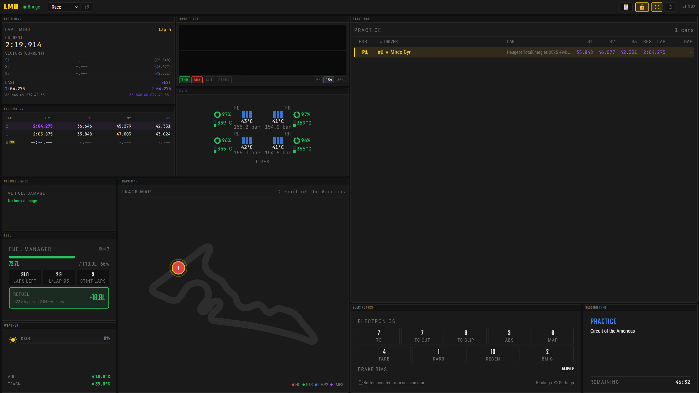

# LMU Pitwall

A real-time sim racing dashboard for [Le Mans Ultimate](https://www.lemansultimate.com/), designed to run on a second (or third, or fourth) monitor.

Built with Rust and React. Runs as a single `.exe` — no installation required, no dependencies, no separate server.



## Features

- **Fuel Manager** — Fuel remaining, consumption per lap (median rolling average), laps remaining, and fuel needed to finish. Excludes first lap of each stint for accurate data.
- **Standings** — Live positions with car number, brand, gap to leader, sector times, and pit status indicator.
- **Electronics** — TC, ABS, Engine Map, ARB, Regen, and Brake Migration with live max values. Reads directly from LMU v1.3 shared memory — no button configuration needed. Works in online sessions.
- **Tires** — Temperatures (inner/middle/outer + carcass), pressures, wear percentage, and brake disc temps per corner.
- **Flags** — Real-time race flag display (green, blue, yellow, red, chequered) with session-phase awareness.
- **Time** — Current session time, time remaining, and lap counter.
- **Track Map** — SVG-based live track map with vehicle positions, updated in real-time.
- **Post Race Results** — Load any LMU session XML log file and view detailed race results: final classification, lap times, sector times, gaps, and pitstops for all drivers.
- **Drag & Drop Layout** — Arrange and resize widgets however you like. Layout is saved automatically.

## How It Works

LMU Pitwall reads telemetry data from the rF2 Shared Memory buffer that Le Mans Ultimate exposes, combined with LMU's built-in REST API (port 6397) for session data. A Rust backend processes the data and serves a React dashboard via an embedded web server — all in one `.exe`.

As of LMU v1.3, electronics values (TC, ABS, ARB, Engine Map, Brake Migration, Regen) are exposed directly in the shared memory telemetry struct, so no button-counting or garage API calls are required. The Electronics widget always shows current values — even in online sessions protected by EasyAntiCheat.

## Download

Grab the latest release from the [Releases page](https://github.com/Swizzjack/lmu-pitwall/releases).

**Option A: Installer** — Download `LMU-Pitwall-Setup-x.x.x.exe` and run it.

**Option B: Portable** — Download `lmu-pitwall.exe`, place it anywhere, and run it.

Shared Memory Plugin (Required)
LMU Pitwall reads telemetry data via the rF2 Shared Memory Map Plugin by TheIronWolf. This is a third-party plugin that is not included with Le Mans Ultimate and must be installed manually.
Check if the plugin is already installed:
Navigate to your LMU installation folder and look for:
Le Mans Ultimate\Plugins\rFactor2SharedMemoryMapPlugin64.dll
If the file exists, skip to step 3. If not, follow the full setup below.

Step 1 — Install the plugin DLL
Download rFactor2SharedMemoryMapPlugin64.dll from the latest release (or use the bundled Plugins.zip from the LMU Pitwall release page).
Create a Plugins folder inside your LMU installation directory if it doesn't exist, and place the DLL there:
Steam\steamapps\common\Le Mans Ultimate\
└── Plugins\
    └── rFactor2SharedMemoryMapPlugin64.dll
    
Step 2 — Enable the plugin in the configuration file
Open (or create) the file CustomPluginVariables.JSON located at:
Le Mans Ultimate\UserData\player\CustomPluginVariables.JSON
If the file is empty or does not contain an entry for the plugin, replace its contents with:
json{
  "rFactor2SharedMemoryMapPlugin64.dll": {
    " Enabled": 1,
    "DebugISIInternals": 0,
    "DebugOutputLevel": 0,
    "DebugOutputSource": 0,
    "DedicatedServerMapGlobally": 0,
    "EnableDirectMemoryAccess": 0,
    "EnableHWControlInput": 0,
    "EnableRulesControlInput": 0,
    "EnableWeatherControlInput": 0,
    "UnsubscribedBuffersMask": 0
  }
}

Note: The space before Enabled ( " Enabled") is intentional — the rF2 plugin engine requires it.

If the file already contains entries for other plugins, add the rFactor2SharedMemoryMapPlugin64.dll block alongside them.

Step 3 — Activate in-game and restart

Launch Le Mans Ultimate
Go to Settings → Gameplay and make sure Enable Plugins is turned ON
Restart Le Mans Ultimate — plugins only take effect after a restart

After restarting, the shared memory buffers will be available and LMU Pitwall can read telemetry data.

## Usage

1. Start Le Mans Ultimate
2. Run LMU Pitwall
3. Open a session (Practice, Qualifying, or Race)
4. The dashboard auto-connects and starts showing live data

The dashboard runs at `http://localhost:9000` by default. You can also open it on any device in your local network by navigating to `http://<your-pc-ip>:9000` in a browser (make sure Windows Firewall allows port 9000).

## Post Race Results

After a session, you can load the XML log file that LMU automatically saves to review detailed results:

1. Open the Post Race Results view
2. Select an XML session file (found in LMU's `UserData\Log\Results\` folder)
3. Browse the full classification with lap times, sectors, gaps, and pitstop data

## Building from Source

Requires: Rust (with cargo-zigbuild), Node.js, Zig 0.13+
```bash
# In WSL2 — every cargo command needs:
export PATH="$HOME/.local/bin:$PATH" && source ~/.cargo/env

# Install dependencies
cd dashboard && npm install && cd ..

# Build release
make build-release
```

The output is a single `.exe` in `bridge/target/x86_64-pc-windows-gnu/release/`.

## Tech Stack

- **Backend:** Rust — rF2 Shared Memory reader, WebSocket server (port 9000), REST API client
- **Frontend:** React + TypeScript — widget-based layout with drag & drop
- **Build:** cargo-zigbuild for Windows cross-compilation from WSL2, rust-embed for single-binary distribution
- **Design:** Dark theme (#0f0f0f background, #facc15 primary, #f97316 accent), Teko / Roboto Condensed / JetBrains Mono fonts

## Credits

Built by [Swizzjack](https://github.com/Swizzjack) with the help of [Claude](https://claude.ai) (Anthropic) for architecture, code generation, and development workflow.

## License

[MIT](LICENSE)
